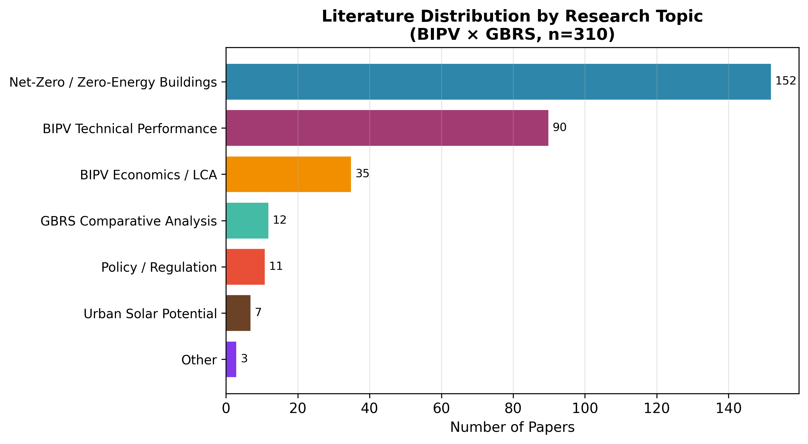
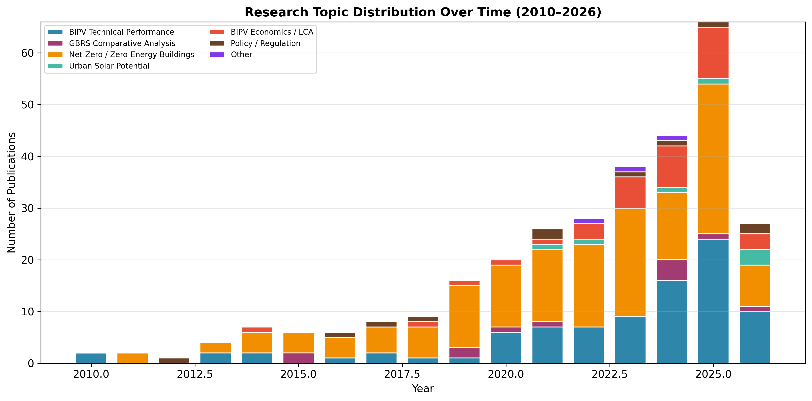
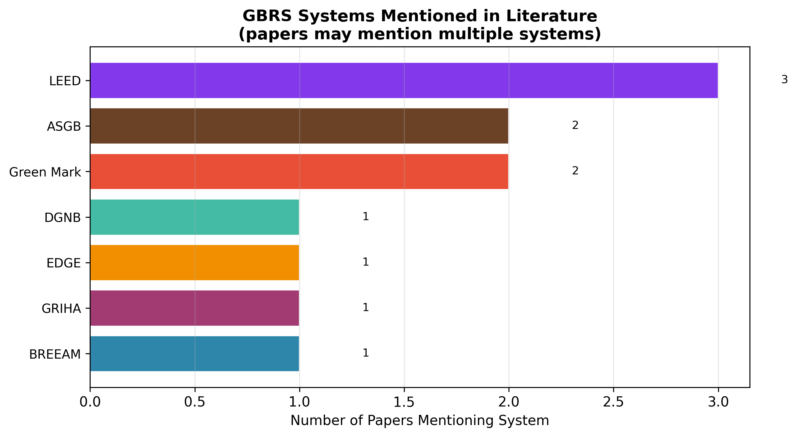
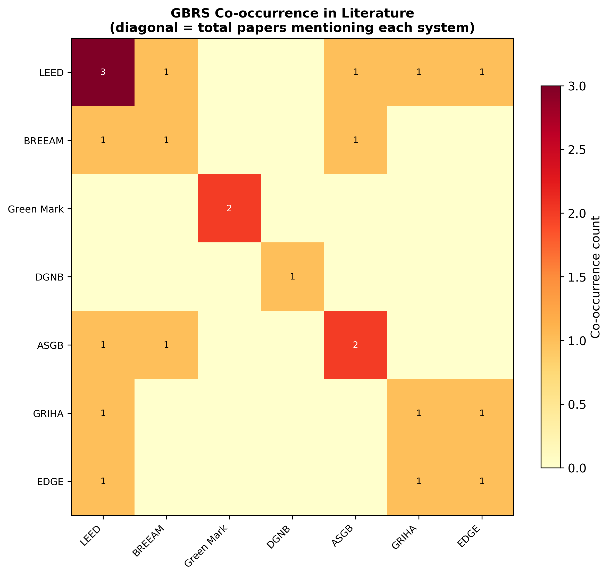
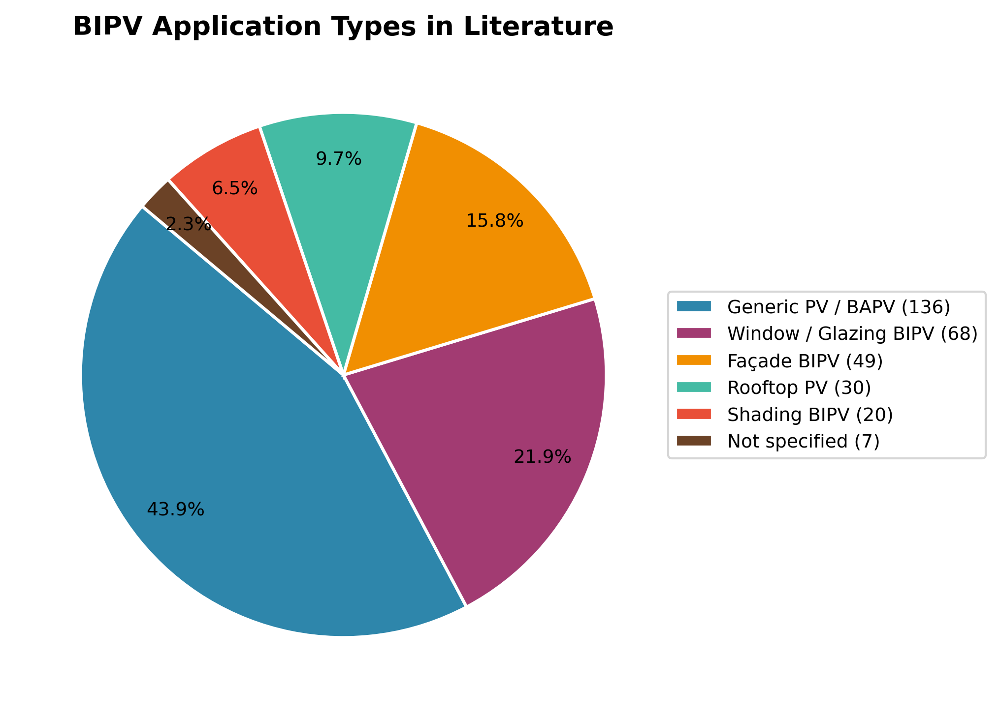
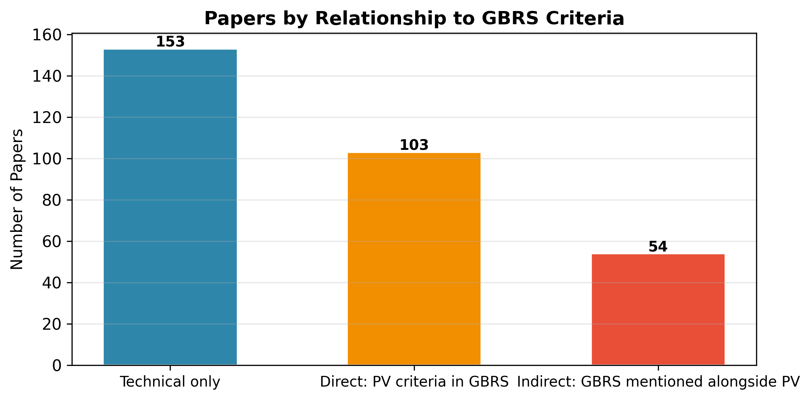

# Literature Content Analysis Report
## BIPV × Green Building Rating Systems — Scopus Dataset (n=310)

> **Generated by:** `src/literature_classification.py`  
> **Dataset:** 310 peer-reviewed papers, 2010–2026  
> **Method:** Keyword-based NLP classification (no external API)

---

## 1. Dataset Overview

- **Total papers analysed:** 310
- **Publication period:** 2010–2026
- **Papers with GBRS direct criteria discussion:** 103 (33.2%)
- **Technical-only papers (no GBRS discussion):** 153 (49.4%)
- **Papers with no GBRS system named:** 303 (97.7%)

## 2. Research Topic Distribution

| Topic Category | Count | % |
|---|---:|---:|
| Net-Zero / Zero-Energy Buildings | 152 | 49.0% |
| BIPV Technical Performance | 90 | 29.0% |
| BIPV Economics / LCA | 35 | 11.3% |
| GBRS Comparative Analysis | 12 | 3.9% |
| Policy / Regulation | 11 | 3.5% |
| Urban Solar Potential | 7 | 2.3% |
| Other | 3 | 1.0% |

**Key observation:** The dominant category is **Net-Zero / Zero-Energy Buildings** (152 papers, 49.0%), confirming that most research at this intersection focuses on technical performance rather than rating system criteria. Only 12 papers explicitly compare GBRS frameworks, highlighting a significant research gap in structured cross-system analysis.

## 3. GBRS Systems Coverage in Literature

| GBRS System | Papers Mentioning | % of corpus |
|---|---:|---:|
| LEED | 3 | 1.0% |
| Green Mark | 2 | 0.6% |
| ASGB | 2 | 0.6% |
| BREEAM | 1 | 0.3% |
| GRIHA | 1 | 0.3% |
| EDGE | 1 | 0.3% |
| DGNB | 1 | 0.3% |
| **No GBRS mentioned** | **303** | **97.7%** |

**Key observation:** **LEED** is the most frequently cited GBRS (3 papers, 1.0%), followed by Green Mark (2), ASGB (2), BREEAM (1). Regional systems (Green Mark, CASBEE, DGNB) appear in fewer papers, suggesting an Anglo-American bias in the academic literature. 303 papers (97.7%) mention no specific GBRS, indicating a large body of technical PV research with no rating system context.

## 4. BIPV Application Type Coverage

| Application Type | Count | % |
|---|---:|---:|
| Generic PV / BAPV | 136 | 43.9% |
| Window / Glazing BIPV | 68 | 21.9% |
| Façade BIPV | 49 | 15.8% |
| Rooftop PV | 30 | 9.7% |
| Shading BIPV | 20 | 6.5% |
| Not specified | 7 | 2.3% |

**Key observation:** The majority of papers address generic PV systems rather than specific BIPV integration types. Façade BIPV appears in only 49 papers (15.8%), and window/glazing BIPV in only 68 (21.9%), confirming that non-rooftop BIPV integration remains severely under-researched in the context of building certification.

## 5. Papers by Relationship to GBRS Criteria

| Relationship Type | Count | % |
|---|---:|---:|
| Technical only | 153 | 49.4% |
| Direct: PV criteria in GBRS | 103 | 33.2% |
| Indirect: GBRS mentioned alongside PV | 54 | 17.4% |

## 6. Key Extracted Findings by Theme

> Sentences are ranked by keyword density × citation count of the source paper.

### 6.1. PV credit weight differences across GBRS

> "In this work the feasibility of PV working in non-optimal orientations will be explored by using two
experimental setups: a photovoltaic façade with a southwest orientation and an architectural model of a
building with the façades in the cardinal points, covered with PV."
>  
> — *Performance of photovoltaics in non-optimal orientations: An experimental study* (2015, cited: 47)

> "By collecting and analysing real data on the FCEV power production in V2G mode, and on BIPV production and
household consumption, two different operating modes for the FCEV offering balanced services to a residential
microgrid were identified, namely fixed power output and load following."
>  
> — *Integrating a hydrogen fuel cell electric vehicle with vehicle-to-grid technolog...* (2018, cited: 254)

> "This report also points out future research directions which would help develop BIPV fire prevention
strategies globally."
>  
> — *Fire safety requirements for building integrated photovoltaics (BIPV): A cross-c...* (2023, cited: 51)

> "Three different management system scenarios, designed to analyse the role of electric vehicles as electricity
vector among buildings integrating PV panels and electrical storages, are analysed through a case study
analysis."
>  
> — *Building to vehicle to building concept toward a novel zero energy paradigm: Mod...* (2019, cited: 174)

> "In this perspective dye-sensitized solar cells (DSSCs), which can be obtained in transparent form and with
tunable different colors, offer not only an alternative to the traditional silicon solar cells to be applied
in particular to decorative effects on windows and glass integrated façades, but also to indoor structures
(and furnishings) in order to recapture the energy spent for the inner lighting, thanks to their peculiar
ability of operating in diffuse light condition."
>  
> — *β-Substituted ZnII porphyrins as dyes for DSSC: A possible approach to photovolt...* (2018, cited: 87)

> "Different from conventional LSCs, which typically serve as pure optical devices, TQDGs have to fulfill
requirements as both power-generating components and building construction materials."
>  
> — *Large-Area Transparent "Quantum Dot Glass" for Building-Integrated Photovoltaics* (2022, cited: 42)

### 6.2. BIPV adoption barriers

> "In addition to the economic-related issues proposed by previous research, which has concentrated on
nonspecific BIPV implementation barriers, the findings show that the lack of professionals and the absence of
cost-effective BIPV products and design tools should be given specific attention for BIPV implementation in
Singapore."
>  
> — *Analysis of the barriers to implementing building integrated photovoltaics in Si...* (2022, cited: 40)

> "The results identified that on-site generation of clean energy bundled with economic benefits, Green Mark
certification, and avoidance of CO2 emissions are the most influential drivers, while long-term payback
period, high upfront cost, and low energy conversion efficiency are the three most substantial barriers to
BIPV."
>  
> — *The implementation of building-integrated photovoltaics in Singapore: drivers ve...* (2019, cited: 65)

> "Despite the technical maturity and substantial potential cost reduction of BIPV technologies, there are still
challenges to overcome for the expansion of BIPV applications and their wider adaptation at global level."
>  
> — *Building PV integration according to regional climate conditions: BIPV regional ...* (2022, cited: 85)

> "This study aims to identify relevant barriers that still hinder the greater adoption of BIPV perceived by
stakeholders in Singapore, as well as the drivers for BIPV that would lead building sector to adopt BIPV
technologies."
>  
> — *The implementation of building-integrated photovoltaics in Singapore: drivers ve...* (2019, cited: 65)

> "Under similar operating conditions and for systems operating all year long, the acceptable cost to recover the
heat from the BIPV system in order to break even with the cost of the PV+T system was found to be 7000CAD."
>  
> — *A novel approach to compare building-integrated photovoltaics/thermal air collec...* (2014, cited: 59)

> "Barriers and limitations of the BIPV implementation at a larger scale are discussed and the emerging research
needs are revealed."
>  
> — *Building PV integration according to regional climate conditions: BIPV regional ...* (2022, cited: 85)

### 6.3. BIPV adoption drivers

> "The results identified that on-site generation of clean energy bundled with economic benefits, Green Mark
certification, and avoidance of CO2 emissions are the most influential drivers, while long-term payback
period, high upfront cost, and low energy conversion efficiency are the three most substantial barriers to
BIPV."
>  
> — *The implementation of building-integrated photovoltaics in Singapore: drivers ve...* (2019, cited: 65)

> "At the same time, based on the results of the above assessment, the challenges facing the development of BIPV
in China are summarized, and specific incentives for new BIPVs are proposed to address the challenges as well
as strategic approaches to optimize BIPVs that are applicable to China as well as Europe and the US."
>  
> — *Net-Zero Energy Consumption Building in China: An Overview of Building-Integrate...* (2023, cited: 31)

> "This study aims to identify relevant barriers that still hinder the greater adoption of BIPV perceived by
stakeholders in Singapore, as well as the drivers for BIPV that would lead building sector to adopt BIPV
technologies."
>  
> — *The implementation of building-integrated photovoltaics in Singapore: drivers ve...* (2019, cited: 65)

> "Furthermore, one-way analysis of variance (ANOVA) was conducted to examine whether the various stakeholder
groups perceive the drivers and barriers differently."
>  
> — *The implementation of building-integrated photovoltaics in Singapore: drivers ve...* (2019, cited: 65)

> "It was discovered that various stakeholder groups perceive the drivers similarly, but the significantly
different opinions have been perceived on several barriers."
>  
> — *The implementation of building-integrated photovoltaics in Singapore: drivers ve...* (2019, cited: 65)

> "It also presents a case study on how this novel approach can be used to demonstrate the actual energy and
economic benefits of BIPV/T air systems compared to side-by-side PV modules and solar thermal collectors for
residential applications."
>  
> — *A novel approach to compare building-integrated photovoltaics/thermal air collec...* (2014, cited: 59)

### 6.4. GBRS influence on PV/BIPV adoption

> "The results identified that on-site generation of clean energy bundled with economic benefits, Green Mark
certification, and avoidance of CO2 emissions are the most influential drivers, while long-term payback
period, high upfront cost, and low energy conversion efficiency are the three most substantial barriers to
BIPV."
>  
> — *The implementation of building-integrated photovoltaics in Singapore: drivers ve...* (2019, cited: 65)

> "This study aims to identify relevant barriers that still hinder the greater adoption of BIPV perceived by
stakeholders in Singapore, as well as the drivers for BIPV that would lead building sector to adopt BIPV
technologies."
>  
> — *The implementation of building-integrated photovoltaics in Singapore: drivers ve...* (2019, cited: 65)

> "This study provides suggestions to overcome barriers to BIPV not only in Singapore, but also other countries
that aim to promote BIPV technologies."
>  
> — *The implementation of building-integrated photovoltaics in Singapore: drivers ve...* (2019, cited: 65)

> "This article presents a new sustainable energy solution using photovoltaic-driven liquid air energy storage
(PV-LAES) for achieving the combined cooling, heating and power (CCHP) supply."
>  
> — *Photovoltaic-driven liquid air energy storage system for combined cooling, heati...* (2024, cited: 58)

> "Since many provinces have issued relevant policies to promote distributed PVs, the findings can provide
guidance for BIPV deployment in China."
>  
> — *Potential of residential building integrated photovoltaic systems in different r...* (2023, cited: 58)

> "This research promotes conscious of BIPV as a crucial innovative solution in implementing PV panel on building
without sacrificing the architectural aesthetic value."
>  
> — *Design and assessment of building integrated PV (BIPV) system towards net zero e...* (2023, cited: 44)

### 6.5. Policy and GBRS interaction

> "Also, harmonisation of building codes hampers BIPV development."
>  
> — *A comparative review of building integrated photovoltaics ecosystems in selected...* (2018, cited: 113)

> "The concurrent demands of environmental comfort and the need to improve energy efficiency for both new and
existing buildings have motivated research into finding solutions for the regulation of incoming solar
radiation, as well as ensuring occupant thermal and visual comfort whilst generating energy onsite."
>  
> — *Intelligent windows for electricity generation: A technologies review* (2022, cited: 41)

> "Energy sustainability and interconnectivity are the two main pillars on which cutting-edge architecture is
based and require the realization of energy and intelligent devices that can be fully integrated into
buildings, capable of meeting stringent regulatory requirements and operating in real-world conditions."
>  
> — *Certification Grade Quantum Dot Luminescent Solar Concentrator Glazing with Opti...* (2024, cited: 27)

> "CO2 emissions of buildings have a critical impact on the global climate change, and various green building
rating systems (GBRS) have suggested low-carbon requirements to regulate building emissions."
>  
> — *Low-carbon design path of building integrated photovoltaics: A comparative study...* (2021, cited: 26)

> "In particular, this assessment is performed to provide an accurate quantification of the thermal
characteristics of the tested BIPV technologies in compliance with the prevailing green building codes."
>  
> — *Evaluation of in-situ thermal transmittance of innovative building integrated ph...* (2021, cited: 18)

> "The computer tool for fast modelling combines (i) upgraded national certificated software for energy
performance of buildings (EPB) evaluation, which is used for performing auto-repeating numerical calculations
based on the design of experiments (DOE) and (ii) software for the determination of multiple linear regression
models and the presentation of results."
>  
> — *Fast modelling of NZEB metrics of office buildings built with advanced glass and...* (2019, cited: 8)

## 7. Implications for the Review Paper

Based on the content analysis of 310 papers, the following gaps and opportunities are identified:

### 7.1 Research Gaps Confirmed
1. **Sparse GBRS-specific literature:** Only 103 papers (33.2%) directly discuss PV within GBRS criteria — a clear gap this review fills.
2. **Non-rooftop BIPV underrepresented:** Façade and glazing BIPV receive minimal attention in the context of certification, despite being architecturally significant.
3. **Regional GBRS neglected:** CASBEE, DGNB, ASGB, and BEAM Plus are mentioned far less frequently than LEED and BREEAM, suggesting geographic bias in existing reviews.
4. **Quantitative credit-weight analysis absent:** No paper in the corpus provides a systematic, multi-dimensional scoring of how GBRS handle BIPV — the core contribution of this review.

### 7.2 Useful References by Theme

**PV credit weight differences across GBRS:** 8 relevant papers identified
  - Performance of photovoltaics in non-optimal orientations: An experimental study (2015) (cited 47×)
  - Integrating a hydrogen fuel cell electric vehicle with vehicle-to-grid technology, photovo (2018) (cited 254×)
  - Fire safety requirements for building integrated photovoltaics (BIPV): A cross-country com (2023) (cited 51×)

**BIPV adoption barriers:** 8 relevant papers identified
  - Analysis of the barriers to implementing building integrated photovoltaics in Singapore us (2022) (cited 40×)
  - The implementation of building-integrated photovoltaics in Singapore: drivers versus barri (2019) (cited 65×)
  - Building PV integration according to regional climate conditions: BIPV regional adaptabili (2022) (cited 85×)

**BIPV adoption drivers:** 8 relevant papers identified
  - The implementation of building-integrated photovoltaics in Singapore: drivers versus barri (2019) (cited 65×)
  - Net-Zero Energy Consumption Building in China: An Overview of Building-Integrated Photovol (2023) (cited 31×)
  - The implementation of building-integrated photovoltaics in Singapore: drivers versus barri (2019) (cited 65×)

**GBRS influence on PV/BIPV adoption:** 8 relevant papers identified
  - The implementation of building-integrated photovoltaics in Singapore: drivers versus barri (2019) (cited 65×)
  - The implementation of building-integrated photovoltaics in Singapore: drivers versus barri (2019) (cited 65×)
  - The implementation of building-integrated photovoltaics in Singapore: drivers versus barri (2019) (cited 65×)

**Policy and GBRS interaction:** 8 relevant papers identified
  - A comparative review of building integrated photovoltaics ecosystems in selected European  (2018) (cited 113×)
  - Intelligent windows for electricity generation: A technologies review (2022) (cited 41×)
  - Certification Grade Quantum Dot Luminescent Solar Concentrator Glazing with Optical Wirele (2024) (cited 27×)

---

*Report generated automatically. Figures saved to `outputs/figures/`.*