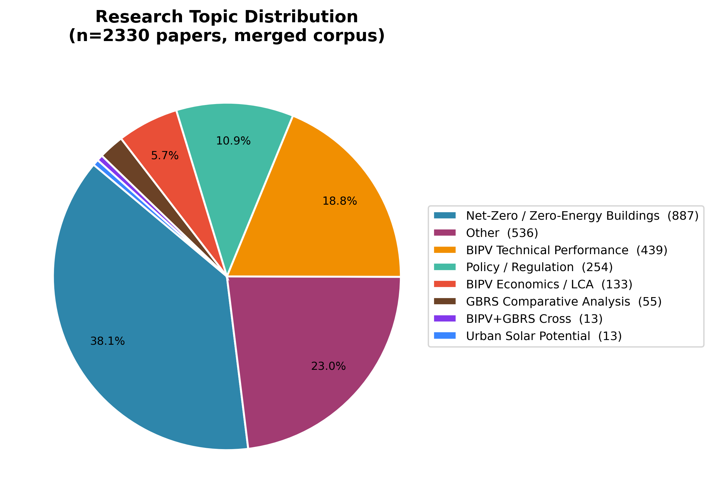
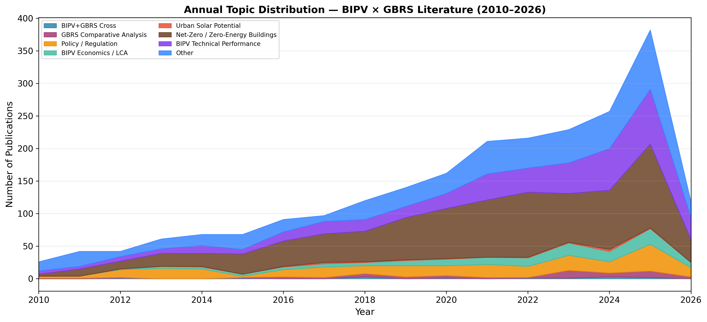
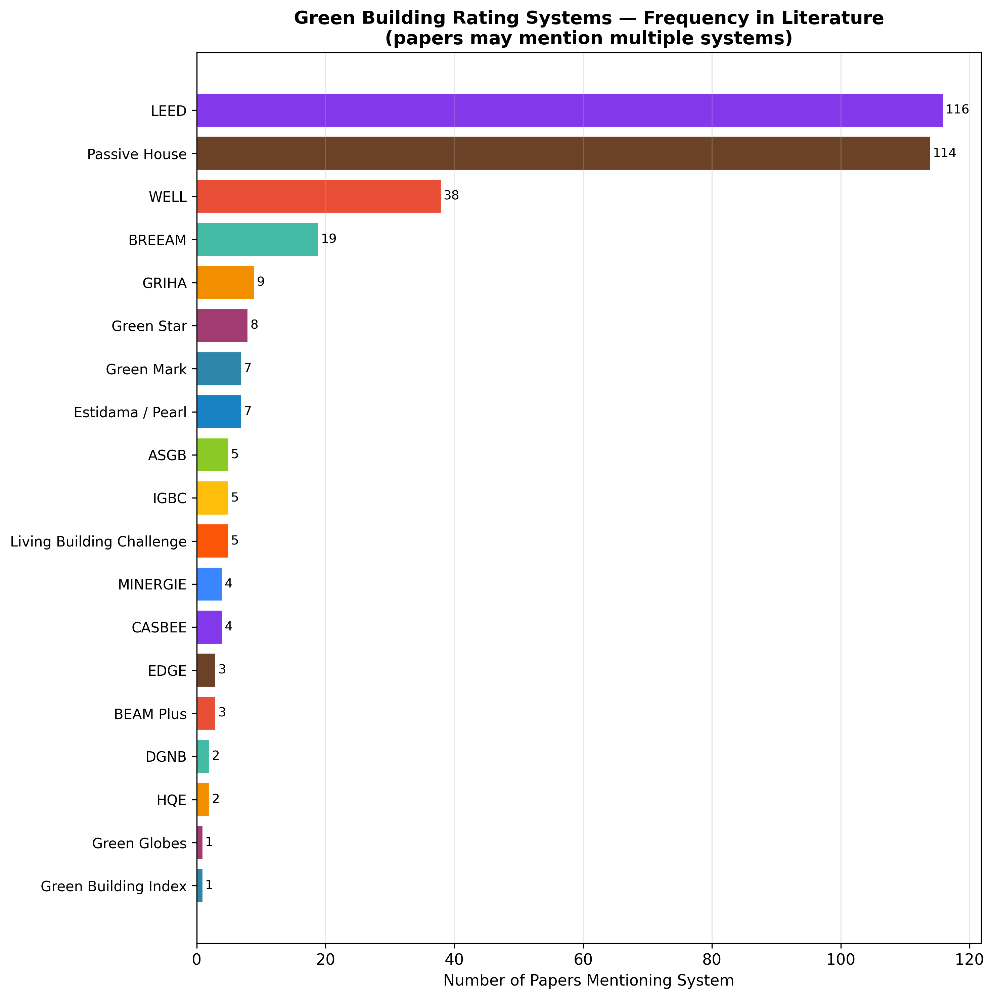
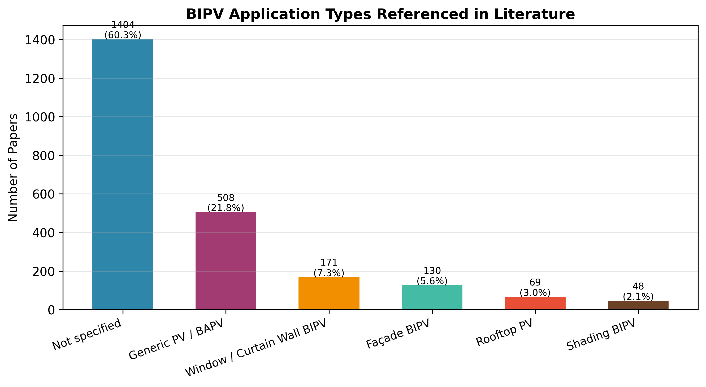

# Literature Content Analysis Report
## BIPV × Green Building Rating Systems — Merged Scopus Corpus (n=2330)

> **Method:** Keyword-based NLP classification (no external API)  
> **Sources:** scopus_export.csv · scopus_search_A/B/C.csv (merged + deduplicated)  
> **Period:** 2010–2026

---

## 1. Dataset Overview

| Metric | Value |
|--------|-------|
| Total unique papers | **2330** |
| Publication period | 2010–2026 |
| BIPV+GBRS cross-topic papers | 13 (0.6%) |
| GBRS comparative papers | 55 (2.4%) |
| Papers naming ≥1 GBRS system | 297 (12.7%) |
| Papers with no GBRS mention | 2033 (87.3%) |

---

## 2. Research Topic Distribution

| Topic Category | Count | Share |
|---|---:|---:|
| Net-Zero / Zero-Energy Buildings | 887 | 38.1% |
| Other | 536 | 23.0% |
| BIPV Technical Performance | 439 | 18.8% |
| Policy / Regulation | 254 | 10.9% |
| BIPV Economics / LCA | 133 | 5.7% |
| GBRS Comparative Analysis | 55 | 2.4% |
| BIPV+GBRS Cross | 13 | 0.6% |
| Urban Solar Potential | 13 | 0.6% |

**Key observation:** The corpus is dominated by *Net-Zero / Zero-Energy Buildings* (887 papers, 38.1%), reflecting the technology-push character of current BIPV research. Only **13** papers (0.6%) explicitly bridge BIPV and GBRS criteria — quantifying the gap this review addresses. Together, 'BIPV+GBRS Cross' and 'GBRS Comparative' account for just 2.9% of the corpus.

---

## 3. GBRS Systems Mentioned in Literature

| System | Papers | % of corpus |
|---|---:|---:|
| LEED | 116 | 5.0% |
| Passive House | 114 | 4.9% |
| WELL | 38 | 1.6% |
| BREEAM | 19 | 0.8% |
| GRIHA | 9 | 0.4% |
| Green Star | 8 | 0.3% |
| Estidama / Pearl | 7 | 0.3% |
| Green Mark | 7 | 0.3% |
| IGBC | 5 | 0.2% |
| ASGB | 5 | 0.2% |
| Living Building Challenge | 5 | 0.2% |
| MINERGIE | 4 | 0.2% |
| CASBEE | 4 | 0.2% |
| BEAM Plus | 3 | 0.1% |
| EDGE | 3 | 0.1% |
| HQE | 2 | 0.1% |
| DGNB | 2 | 0.1% |
| Green Globes | 1 | 0.0% |
| Green Building Index | 1 | 0.0% |
| *No system mentioned* | 2033 | 87.3% |

**Key observation:** LEED is the most cited GBRS (116 papers). Top three: LEED (116), Passive House (114), WELL (38). 2033 papers (87.3%) reference no named system, confirming that most BIPV research is conducted without reference to any rating framework.

---

## 4. BIPV Application Types

| Application Type | Count | % |
|---|---:|---:|
| Not specified | 1404 | 60.3% |
| Generic PV / BAPV | 508 | 21.8% |
| Window / Curtain Wall BIPV | 171 | 7.3% |
| Façade BIPV | 130 | 5.6% |
| Rooftop PV | 69 | 3.0% |
| Shading BIPV | 48 | 2.1% |

**Key observation:** Non-rooftop BIPV (façade + window/curtain wall) accounts for 12.9% of papers (301 papers). Despite its architectural significance, window/curtain-wall BIPV and façade BIPV remain under-represented relative to generic PV systems, suggesting that GBRS criteria for building-integrated applications lag behind emerging technology.

---

## 5. Key Extracted Findings

> Full evidence sentences are in `data/processed/key_findings.md`.

### 5.1. Barriers to BIPV adoption

> "The aim of this research is to identify the technical barriers and risks associated with the application of BIPV
from building design through to operation stages, together with proposing possible solutions."
> — *Overcoming technical barriers and risks in the application of building inte…* (2015 · cited 92×)

> "By analyzing the additional cost of the three types of green buildings, it is concluded that the major barrier, the
higher costs has hindered the extensive application of green technologies in China."
> — *Green property development practice in China: Costs and barriers* (2011 · cited 256×)

> "This study aims to identify relevant barriers that still hinder the greater adoption of BIPV perceived by
stakeholders in Singapore, as well as the drivers for BIPV that would lead building sector to adopt BIPV
technologies."
> — *The implementation of building-integrated photovoltaics in Singapore: drive…* (2019 · cited 65×)

> "Barriers and limitations of the BIPV implementation at a larger scale are discussed and the emerging research needs
are revealed."
> — *Building PV integration according to regional climate conditions: BIPV regi…* (2022 · cited 85×)

### 5.2. Drivers and incentives for BIPV

> "Successful BIPV policies should create clear incentives for BIPV adopters, either in the form of financial support
or inclusion of BIPV in building codes or labels."
> — *The adoption of building-integrated photovoltaics: barriers and facilitator…* (2018 · cited 113×)

> "While they enable emission-free driving, their supply chains are associated with environmental and socio-economic
impacts."
> — *Comparative sustainability assessment of lithium-ion, lithium-sulfur, and a…* (2023 · cited 54×)

> "The simultaneous optimization of building shell improvements and DER investments enables building owners to take
one step further towards nearly zero energy buildings (nZEB) or nearly zero carbon emission buildings (nZCEB), and
therefore support the 20/20/20 goals."
> — *Optimizing Distributed Energy Resources and building retrofits with the str…* (2014 · cited 158×)

> "The study results show that significant performance improvement potentials exist if NZEB collaborations are
enabled."
> — *Building-group-level performance evaluations of net zero energy buildings w…* (2018 · cited 58×)

### 5.3. Net-zero targets and PV integration

> "However, the optimized hybrid system (integrated with solar PV, solar thermal and heat insulation solar glass) is
sufficient to reach the net-zero energy target while the optimized solar PV system combined heat insulation solar
glass is a solution of the positive energy building."
> — *Energetic and economic evaluation of hybrid solar energy systems in a resid…* (2019 · cited 101×)

> "Each HVAC configuration was paired with a PV system sized to exactly reach the net-zero energy target, so the
economics were compared based on the initial PV + HVAC cost."
> — *Net-zero nation: HVAC and PV systems for residential net-zero energy buildi…* (2018 · cited 112×)

> "The study finds that (a) achieving net-zero-energy requires a 40% larger photovoltaic system than is technically
optimal for the household; (b) achieving net-zero-energy fails to achieve net-zero-carbon by some 0.252 tCO2/y; (c)
achieving net-zero-carbon would require a 60% larger than optimal photovoltaic system; and (d) it would be more
economical to invest in remote wind power than in excess photovoltaic capacity."
> — *Net-zero-energy buildings or zero-carbon energy systems? How best to decarb…* (2022 · cited 55×)

> "Results show that while it is achievable to build a net-zero energy landed house with only rooftop solar panels, it
is much more difficult to achieve net-zero energy for apartment buildings."
> — *A holistic design approach for residential net-zero energy buildings: A cas…* (2019 · cited 82×)

### 5.4. GBRS credit/weight allocation for PV

> "In this study, the first part of the climate adaptive facade element – solar facade module is developed: the point
focus imaging Fresnel lens is employed for concentrating solar beam on copper plate with fins which is used as heat
transfer enhancer to phase change material."
> — *Solar facade module for nearly zero energy building* (2018 · cited 76×)

> "Based on the weighted geometric mean, the solar PV system has a low sustainability score of 0.56 using the panel
method and a high score of 0.59 using the hierarchist and equal weighting methods."
> — *Sustainability assessment of energy systems: A novel integrated model* (2019 · cited 69×)

> "Based on the proposed method, the RAF scores of a range of renewable and nonrenewable energy alternatives are
determined using their previously reported performance values under four sustainability criteria, namely carbon
footprint, water footprint, land footprint, and cost of energy production."
> — *A system of systems approach to energy sustainability assessment: Are all r…* (2015 · cited 135×)

> "A LEED-platinum credited NZEB was chosen for tests and a previous study was revisited to set a baseline (non-NZEB)
with refined data for comparative analyses."
> — *An ecological understanding of net-zero energy building: Evaluation of sust…* (2017 · cited 54×)

### 5.5. Policy and regulatory context

> "This research explored the applicability of the proposed passive design optimization approach in diverse climates,
and can therefore prompt decision-makers’ endorsement as a national green building design tool in the early
planning stage."
> — *Integrated energy performance optimization of a passively designed high-ris…* (2018 · cited 88×)

> "It was produced by cutting standard crystalline silicon solar cells into narrow strips and then automatically
welding and connecting the strips into continuous strings for laminating between two layers of glass."
> — *Study on the overall energy performance of a novel c-Si based semitranspare…* (2019 · cited 137×)

> "The simultaneous consideration of the expansion planning requirements and the operational details of the energy
system becomes mandatory when the variable renewable energy generation significantly increases."
> — *The multi-energy system co-planning of nearly zero-energy districts – Statu…* (2020 · cited 79×)

> "The tourism sector is a key source of national income, and the use of renewable energy resources promotes green and
sustainable tourism."
> — *Techno-economic study and the optimal hybrid renewable energy system design…* (2023 · cited 71×)

### 5.6. GBRS influence on PV/BIPV adoption

> "The review also assesses the standardization and certification of BIPV systems, emphasizing standardized practices
for quality and safety."
> — *Comprehensive review and state of play in the use of photovoltaics in build…* (2024 · cited 43×)

> "Moreover, the building was rated using the Leadership in Energy and Environmental Design (LEED) rating tool, and it
qualifies for silver certification after retrofits and the integration of renewable energy sources (RES)."
> — *Reduction in energy consumption and CO2 emissions by retrofitting an existi…* (2023 · cited 42×)

> "This review uncovers numerous innovative practices including greenhouse gas emissions caps per square meter of
building space, energy performance certificates with retrofit recommendations, and inclusion of renewable energy to
achieve 'nearly zero-energy buildings'."
> — *Mandating better buildings: A global review of building codes and prospects…* (2016 · cited 27×)

> "In this context, the proposed work experimentally evaluates the thermal performance of five innovative building
integrated photovoltaic (BIPV) technologies, and assesses its feasibility to be integrated as building envelopes to
attain the required green mark certification benchmarks in Singapore."
> — *Evaluation of in-situ thermal transmittance of innovative building integrat…* (2021 · cited 18×)

---

## 6. Research Gaps — Implications for This Review

1. **Sparse BIPV×GBRS literature:** Only 68 papers (2.9%) discuss both domains together. A systematic, multi-dimensional scoring of how 21 GBRS handle BIPV is absent.

2. **Anglo-American GBRS bias:** LEED and BREEAM dominate mentions; regional systems (CASBEE, DGNB, Green Mark, ASGB, HQE, GRIHA) are under-studied.

3. **Non-rooftop BIPV neglected:** Façade and window/curtain-wall BIPV have minimal representation in the context of certification criteria.

4. **Performance verification gap:** Few papers address post-occupancy monitoring of BIPV within GBRS frameworks.

5. **Standards lag:** IEC 63092 (BIPV product standard) is almost never referenced alongside GBRS, indicating a disconnect between product standards and building certification.

---

*Report generated automatically by `src/literature_classification.py`*